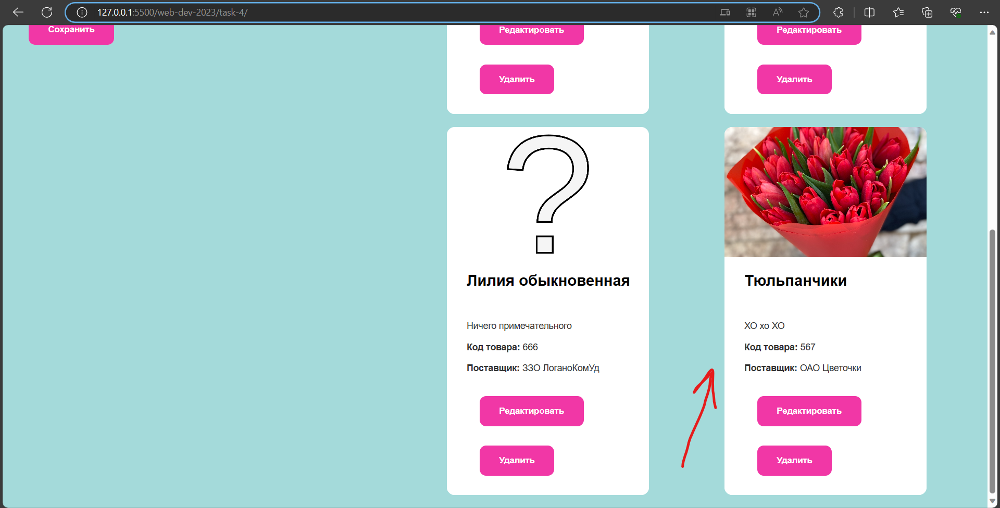

# Как использовать приложение "Админка Карточек"

## Предварительные шаги
1. прописываем команду npm install -g json-server
2. запускаем сервер с базой данных npm run server
3. Убедитесь, что у вас установлен Visual Studio Code.
4. Установите плагин Live Server (это у нас клиентский сервер) для Visual Studio Code.

## Добавление новой карточки
1. Заполняем форму

2. Нажимаем кнопку сохранить

3. Ура ура - наша карточка отобразилась!

## Удаление карточек
1. Нажимаем на нужную кнопку

2. Готово!

## Редактирование карточки
1. Нажимаем на нужную кнопку

2. Меняем данные в форме
3. Нажимаем сохранить

4. Готово!

## Cброс к изначальным карточкам
1. Нажимаем на кнопку

2. Готово!
